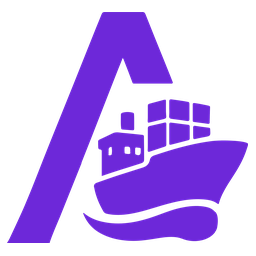

# Arcane for Home Assistant

A Home Assistant integration for [Arcane](https://github.com/getarcaneapp/arcane), the
modern Docker management UI. It brings your containers and Compose projects into Home
Assistant as devices you can watch and control, comparable to what the Portainer
integration does, but built on Arcane's own API.

<br clear="left">

## What you get

One device per environment, one per container and one per Compose project.

### Environment device

| Entity | Type | Notes |
| --- | --- | --- |
| Online | binary sensor | Whether Arcane can reach the environment |
| Containers / Containers running / Containers stopped | sensor | Live counts |
| Container updates available | sensor | Containers whose image has a newer version |
| Unhealthy containers | sensor | Containers whose health check is failing |
| Projects / Projects running | sensor | Compose project counts |
| Images / Unused images / Image storage | sensor | Image usage from Arcane |
| Volumes / Unused volumes / Networks | sensor | Volume and network usage |
| Host CPU / Host memory / Host disk | sensor | Usage of the machine, off by default |
| Docker version / Arcane version | sensor | Diagnostic, disabled by default |
| Prune unused | button | Off by default, see below |

### Container device

| Entity | Type | Notes |
| --- | --- | --- |
| *(container name)* | switch | On starts, off stops the container |
| Image update | update | Shows the newer image and installs it with a redeploy |
| Running | binary sensor | |
| Healthy | binary sensor | Only for containers that define a health check |
| Update available | binary sensor | From Arcane's image update check |
| State | sensor | `running`, `exited`, `paused`, and so on |
| Status | sensor | The human readable Docker status |
| Image | sensor | Diagnostic |
| Created | sensor | Diagnostic, disabled by default |
| Restart | button | |
| Redeploy | button | Off by default, pulls the image again and recreates |

### Compose project device

| Entity | Type | Notes |
| --- | --- | --- |
| *(project name)* | switch | On runs `up`, off runs `down` |
| Running | binary sensor | On while at least one service runs |
| Update available | binary sensor | |
| Status | sensor | `running`, `partially running`, `stopped`, and so on |
| Services / Services running | sensor | |
| Restart | button | |
| Redeploy | button | Off by default, pulls and recreates the whole stack |

Containers of a Compose project appear as child devices of that project.
Containers and projects that appear or disappear in Arcane are added and removed while
Home Assistant keeps running.

## Requirements

- Home Assistant 2025.2 or newer
- An Arcane instance reachable from Home Assistant
- An Arcane API key

## Installation

### HACS

1. In HACS, open the three dot menu and choose **Custom repositories**.
2. Add `https://github.com/ProfessorQuantumUniverse/Arcane-HA` with category **Integration**.
3. Install **Arcane** and restart Home Assistant.

### Manual

Copy `custom_components/arcane` into your Home Assistant `config/custom_components/`
directory and restart Home Assistant.

## Setup

1. In Arcane, go to **Settings > API keys** and create a key.
2. In Home Assistant, go to **Settings > Devices & services > Add integration** and pick
   **Arcane**.
3. Enter the address of your Arcane instance (for example `http://192.168.1.10:3552`)
   and the API key.

The address must be the one Arcane is actually served on. Redirects are not followed on
purpose, so that the API key is never replayed against another host. If setup reports a
redirect, use the address the redirect points at.

### API key permissions

Read only monitoring needs:

`environments:list`, `containers:list`, `projects:list`, `images:list`, `volumes:list`,
`networks:list`, `system:read`

Add these for the switches, buttons and update installs:

`containers:start`, `containers:stop`, `containers:restart`, `containers:redeploy`,
`projects:deploy`, `projects:down`, `projects:restart`

Host statistics need `system:read`, the prune button needs `system:prune`.

A key without the action permissions still works. The entities are created and the
actions fail with a clear error. Only `environments:list` is required for setup to
succeed; every other missing permission just leaves that part of the data empty.

## Options

Open the integration and choose **Configure**. The options are grouped into three
sections.

### Polling

| Option | Default | What it does |
| --- | --- | --- |
| Update interval | 30 s | How often Arcane is polled, between 10 and 3600 seconds |
| Environments | all | Restrict the integration to specific environments |
| Containers | on | Create the per container devices and the container counts |
| Compose projects | on | Create the per project devices and the project counts |
| Images, volumes and networks | on | Poll the usage counts and the Docker version |
| Host CPU, memory and disk | off | See *Host statistics* below |
| Include internal containers | off | Also expose containers Arcane marks as internal |
| Include hidden containers | off | Also expose containers hidden in the Arcane interface |

### Entities

| Option | Default | What it does |
| --- | --- | --- |
| Image update entities | on | Offer the per container update entity |
| Health binary sensors | on | Add a Healthy sensor to containers that define a health check |
| Prefix device names with their kind | on | Name devices `Container x` and `Project x` |
| Nest containers under their project | on | Show a container as a child of its Compose project |
| Fire events | on | See *Events* below |

### Control

| Option | Default | What it does |
| --- | --- | --- |
| Allow control from Home Assistant | on | Turn off for a read only setup: no switches, buttons or update installs |
| Redeploy buttons | off | A button per container and project that pulls the image again and recreates |
| Prune button | no button | A button per environment, see *Pruning* below |

Turning parts off also stops the matching API calls, so a large host can be trimmed down
to just what you use.

### Naming

A container and a Compose project regularly carry the same name. Home Assistant builds
entity IDs from the device name, so without a prefix the second one only gets `_2`
suffixed IDs. With the prefix on, the devices are named `Container kopia` and
`Project kopia`, which gives `switch.container_kopia` and `switch.project_kopia`.

Entity IDs that already exist are never rewritten. An existing installation keeps its
current IDs and only newly discovered containers and projects use the new scheme.

## Host statistics

Arcane only offers host CPU, memory and disk usage over a WebSocket, and it sends the
current sample right after the handshake. The integration therefore takes one sample per
update and closes the socket again instead of holding a connection open. It is off by
default because it is one extra connection per update.

Per container CPU and memory are **not** available. Arcane streams those over one
WebSocket per container and refuses more than five concurrent stats connections per
client, so a host with more than a handful of containers cannot be covered that way.

## Events

With events on, these fire on the Home Assistant bus and can be used as automation
triggers:

| Event | Fired when | Data |
| --- | --- | --- |
| `arcane_container_state_changed` | A container changes state | `container`, `state`, `previous_state`, `exit_code`, `crashed`, `oom_killed`, `environment`, `environment_id` |
| `arcane_container_health_changed` | A health check changes | `container`, `health`, `previous_health`, `environment`, `environment_id` |
| `arcane_project_state_changed` | A project changes state | `project`, `project_id`, `status`, `previous_status`, `environment`, `environment_id` |

`crashed` is true when a running container stopped with a non zero exit code, and
`oom_killed` narrows that to exit code 137, the fingerprint of an out of memory kill.
Nothing is fired for the first update after a restart or for a container that has just
appeared.

```yaml
automation:
  - triggers:
      - trigger: event
        event_type: arcane_container_state_changed
        event_data:
          crashed: true
    actions:
      - action: notify.mobile_app
        data:
          message: "{{ trigger.event.data.container }} crashed with exit code {{ trigger.event.data.exit_code }}"
```

## Pruning

The prune button removes **unused images, unused networks and the build cache**.
Containers and volumes are never pruned: both hold state that cannot be pulled back, and
a single button press should not be able to destroy it.

The option chooses how far it goes:

- *No button*: no entity is created. This is the default.
- *Dangling images*: only untagged image layers, plus unused networks and build cache.
- *All unused images*: also images that no container currently uses.

A button has no confirmation dialog in Home Assistant, so leave it off unless you want
that one press to act immediately.

## Notes on security

- The API key is sent in the `X-Api-Key` header, never in a URL, and is redacted from
  diagnostics downloads.
- Only `http://` and `https://` addresses are accepted. Addresses that carry credentials
  are rejected, because they would end up in log lines.
- Redirects are not followed, so a redirect cannot make Home Assistant hand the API key
  to a different host.
- Certificate verification can be switched off for a self signed certificate. Home
  Assistant then logs a warning at startup, because the connection carrying the API key
  is no longer authenticated. Prefer a trusted certificate or plain HTTP on a network
  you control.
- Give the key only the permissions you need. The read only option above pairs well with
  a key that holds no action permissions at all.

## Notes on behaviour

- Every selected environment is polled, including remote agents. An unreachable
  environment is reported as offline instead of failing the whole update, and a
  permission the key lacks only empties that part of the data.
- Container entities are keyed by container name, so they survive a redeploy that gives
  the container a new ID.
- Stopping a Compose project runs `down`, which removes its containers. The container
  entities for that project disappear until it is deployed again.
- Installing a container image update runs Arcane's redeploy: it pulls the image the
  container was created from and recreates the container with the same configuration.
- A health sensor is added when a container reports a health check at the moment it is
  discovered. A container that gains a health check later picks the sensor up after the
  integration is reloaded.

## Development

```bash
python -m venv .venv
.venv/bin/pip install -r requirements_test.txt
.venv/bin/python -m pytest
```
